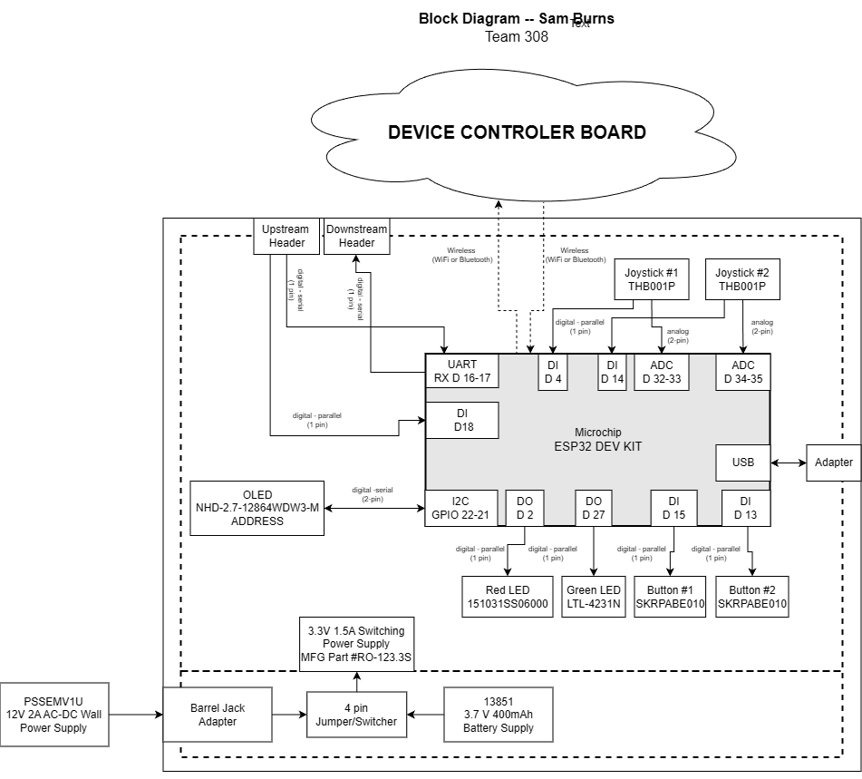

## Overview
This is the inital draft of my individual block diagram. This visually shows how the my project is connected to the microcontroller and my team. 

Key points are:

1. Power: 3.3 v
1. This is the HMI (Human Machine Interface) for the main prototype
1. Wirelessly connected to the project via the Control board
1. Power source: Battery or Barraljack(backup)
1. Upstream and Downstream headers act as backup connections
1. Joysticks + Buttons cause updates on the OLED display and controls the project

The PDF download can be found ["here"](diagram.pdf).