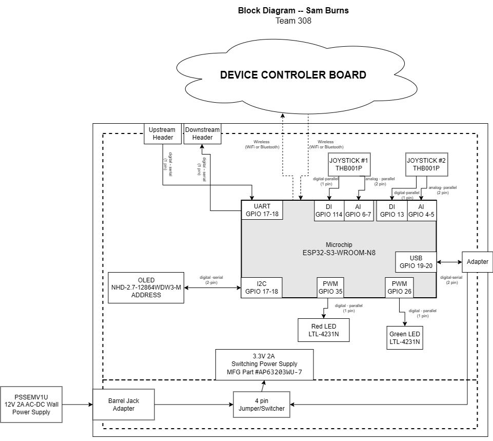

## Overview
This is the updated draft of my individual block diagram. This visually shows how the my project is connected to the microcontroller and my team. 

Key points are:

1. Power: 3.3 v
1. This is the HMI (Human Machine Interface) for the main prototype
1. Wirelessly connected to the project via the Control board
1. Power source: Battery or Barraljack(backup)
1. Upstream and Downstream headers act as backup connections
1. Joysticks + Buttons cause updates on the OLED display and controls the project

### Hardware Pin Reference

| Function        | Pin      |
|-----------------|----------|
| UART TX         | GPIO 37  |
| UART RX         | GPIO 36  |
| OLED SCL        | GPIO 18  |
| OLED SDA        | GPIO 17  |
| Joystick 1 X    | GPIO 6   |
| Joystick 1 Y    | GPIO 6   |
| Joystick 1 Btn  | GPIO 14  |
| Joystick 2 X    | GPIO 4   |
| Joystick 2 Y    | GPIO 5   |
| Joystick 2 Btn  | GPIO 13  |
| LED (activity)  | GPIO 35  |
| LED (alert)     | GPIO 36  |

The PDF download can be found ["here"](diagram3.pdf).

## Final Notes

This block diagram was citircal to laying out the wiring of all the componets. While I will explain more on the PCB layout to some of the external modification I had to make to get this project working, all the main componets still worked in the same configuraiton. 