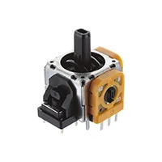
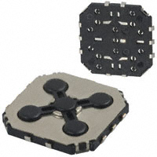
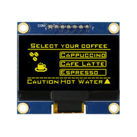
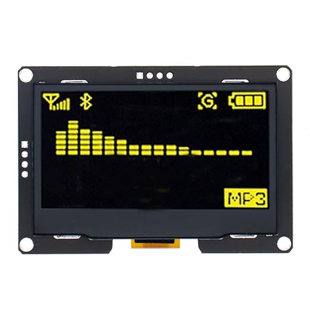

## Module's Selected Major Components

The following sections are the selected major components necessary for  .....

>**For each of the following sections, use <ins>one of the two styles</ins> given near the end. *REMOVE THIS NOTE***

### Power Management

I will proceed with option 2 due to being the least expensive option I found. 

For more details, review the ["Appendix - Component Selection Process - Power Mangement"](https://embedded-systems-design.github.io/EGR314DataSheetTemplate/Appendix/01-Componet-Selection/Component-Selection-Process/#power-management) selection.

### Joystick

I will proceed with JS1300AQ (#3) due to how simple and inexpensive the product is. I believe that desipait losing the range of an analog joystick, given enough code it would preform just the same. 

### OLED

I choose option 3 due to being largest screen. This will help a lot to show real time data coming back from our submarine.

For more details, review the ["Appendix - Component Selection Process - Actuator"](https://embedded-systems-design.github.io/EGR314DataSheetTemplate/Appendix/01-Componet-Selection/Component-Selection-Process/#actuator) selection.

-----------
> Remove the following before submitting! Use them to present the selected components

### Component selection 

**Joystick**

| **Component**                                                                                                                                                                                      | **Pros**                                                                                                                                    | **Cons**                                                                                            |
| ------------------------------------------------------------------------------------------------------------------------------------------------------------------------------------------------- | ------------------------------------------------------------------------------------------------------------------------------------------- | --------------------------------------------------------------------------------------------------- |
|   #1 SKRHAAE010 surface mount Joystick $2.98/each [link to product](https://www.digikey.com/en/products/detail/alps-alpine/SKRHAAE010/19529098)                 | \* Inexpensive  \* Low profile  \* Meets surface mount constraint of project  \* No possible way for to get stick drift                                                | \* Limited output range compared to an analog joystick   \* Needs additional parts to be user friendly |
|   #2 THB001P Through hole mount Joystick $3.04/each [link to product](https://www.digikey.com/en/products/detail/c-k/THB001P/11687191)                 | \* Typical Joystick configuration  \* Highrange of outputs \* Enables persision control                                                | \* Doesn't meet surface mount constraint of project \* Possiblity of stickdrift |
|   #3 JS1300AQ surface mount D-Pad $2.18/each [link to product](https://www.digikey.com/en/products/detail/e-switch/JS1300AQ/1556576)                 | \* Larger input area  \* Easier to use \* Cheaper compared to other selected options                                                | \*Limited outputs  \* Large footprint compared to other selected options |    

**Screen**

| **Component**                                                                                                                                                                                      | **Pros**                                                                                                                                    | **Cons**                                                                                            |
| ------------------------------------------------------------------------------------------------------------------------------------------------------------------------------------------------- | ------------------------------------------------------------------------------------------------------------------------------------------- | --------------------------------------------------------------------------------------------------- |
|   #1 26095 Through hole OLED  $4.99/each [link to product](https://www.digikey.com/en/products/detail/universal-solder-electronics-ltd/26095/16822116)                 | \* Familiar with due to Lab  \* Low profile  \*Popular option with a lot of open source help                                             | \* Small screen   \* Doesn't meet Surface mount constraints of project |
|   #2 WEA012864ALAP3N00E00 Through hole OLED  $14.78/each [link to product](https://www.digikey.com/en/products/detail/winstar-display/WEA012864ALAP3N00E00/24883012)                 | \* Larger screen  \* Yellow text                                             | \* Unfamilar pin set up   \*Very expensive   \* Doesn't meet Surface mount constraints of project |
|   #3 B0CFF2TSJ1 Through hole OLED  $16.99/each [link to product](https://www.digikey.com/en/products/detail/winstar-display/WEA012864ALAP3N00E00/24883012)                 | \* Largest screen out of my selection  \* Same address as one provided in class, just larger pixels                                             | \* Seems to only be sold on Amazon   \*Very expensive   \* Doesn't meet Surface mount constraints of project |

**Voltage regulator**

| **Component**                                                                                                                                                                                      | **Pros**                                                                                                                                    | **Cons**                                                                                            |
| ------------------------------------------------------------------------------------------------------------------------------------------------------------------------------------------------- | ------------------------------------------------------------------------------------------------------------------------------------------- | --------------------------------------------------------------------------------------------------- |
|   #1 LP3996SD-0833/NOPB Dual output Voltage regulator  $1.12/each [link to product](https://www.digikey.com/en/products/detail/texas-instruments/LP3996SD-0833-NOPB/1590116)                 | \* Small foot print  \* dual output  \*Will short if over powered                                            | \*Limited Input voltage   \* Possibly over complicated for project |
|   #2 MIC5365-3.3YC5-TR Voltage regulator  $0.12/each [link to product](https://www.digikey.com/en/products/detail/microchip-technology/MIC5365-3-3YC5-TR/1868094)                 | \* Simple desing  \* Very inexpensive                                             | \* Low input Voltage   \* Limited Output current |
|   #3 AZ1117CH-3.3TRG1 Voltage regulator  $0.16/each [link to product](https://www.digikey.com/en/products/detail/diodes-incorporated/AZ1117CH-3-3TRG1/4470985)                 | \* Highest input Voltage out of my selection  \* Higher output current                            | \* No over voltage protection built in   \*Long manufacturing time  |

<!-- ### Style 2

> Also acceptable, more markdown friendly

**External Clock Module**

1. XC1259TR-ND surface mount crystal

    

    * $1/each
    * [link to product](http://www.digikey.com/product-detail/en/ECS-40.3-S-5PX-TR/XC1259TR-ND/827366)

    | Pros                                      | Cons                                                             |
    | ----------------------------------------- | ---------------------------------------------------------------- |
    | Inexpensive                               | Requires external components and support circuitry for interface |
    | Compatible with PSoC                      | Needs special PCB layout.                                        |
    | Meets surface mount constraint of project |

**Rationale:** A clock oscillator is easier ... -->
