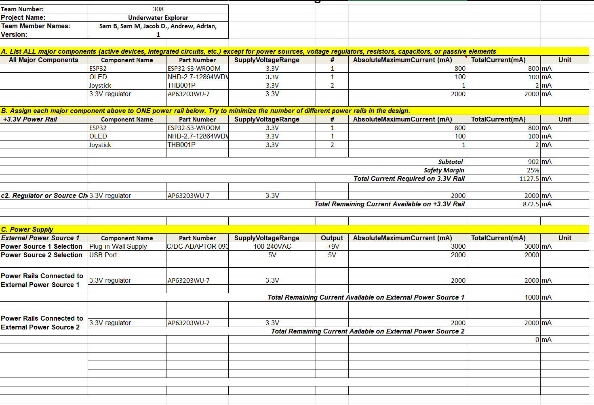

## Overview
First version of my Power Budget. 

{style width:"350" height:"300;"}

## Conclusions

This is just a rough draft, I intend to finalize this as we get closer to closing out this project.

## Resouces

The power budget as a PDF download is available [*here*](powerBudget.pdf), and a Microsoft Excel Sheet [*here*](PowerBudgetSamBurns.xlsx).

## Final Notes: 

I still believe that this sheet it accurate. However as stated before the Power regulator issue, once corrected would effect this page due to having a far more robust regulator to ensure stable and reliable power. I also endded up needing to using the barraljack, simply due to the use time at the inovation showcase. A simple battery pack would have not have lasted that long. That being said be aware that at the showcase it might power cycle a lot.