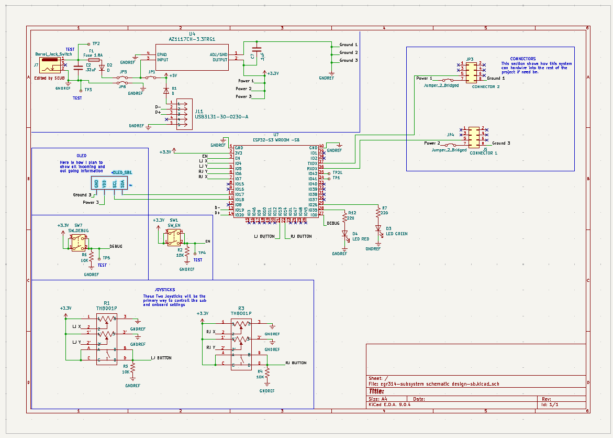

## Overview

This schematic is my inital version of the HMI system. It has dual joystick controlls, along with a OLED. This inital design is very simple at this stage and will likely have to get addjusted to better suit the teams final design. The board will utalize power either from the usb or the onboard barrewljack socket. A battery system will likely be added in the future. This system will talk to the controller board via LAN or Bluetooth. The onboard OLED and LEDs will provide status updates and will notify the user of what the sub is sensing. Through the menu navigation the user can also adjust settings while the sub is active. The user will simply engage one of the Joystiks center buttons and enable the other to navigate the menu system. 

{style width:"350" height:"300;"}
**Figure ##:** Showing the schematic.

## Resouces

The schematic as a PDF download is available [*here*](schematic_SB_V1.pdf), and the Zip folder of the project [*here*](egr314-subsystem-schematic-design-sbV1.2.zip).