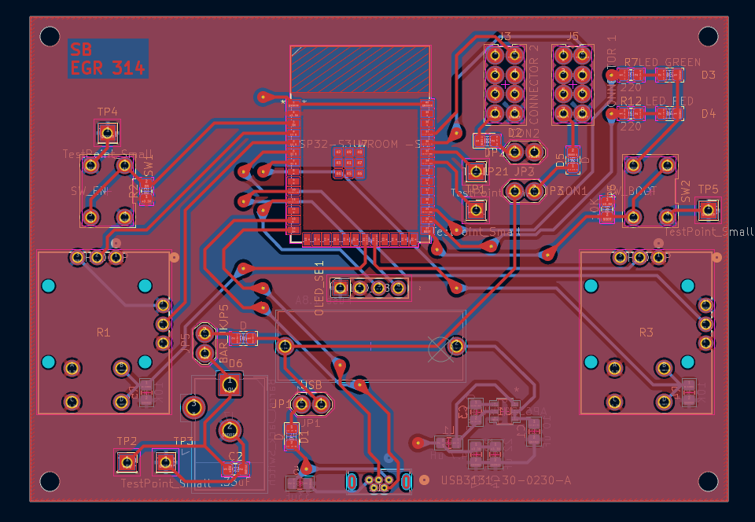

## PCB

This PCB is based on the schematic described earlier. 

{style width:"350" height:"300;"}
**Figure ##:** Showing the schematic.

## Resouces

The schematic as a PDF download is available [*here*](color.pdf), the Gerber Zip folder of the project [*here*](SamBurns308Gerber.zip), and the JLCDRM check PDF is available [*here*](DFM.pdf).