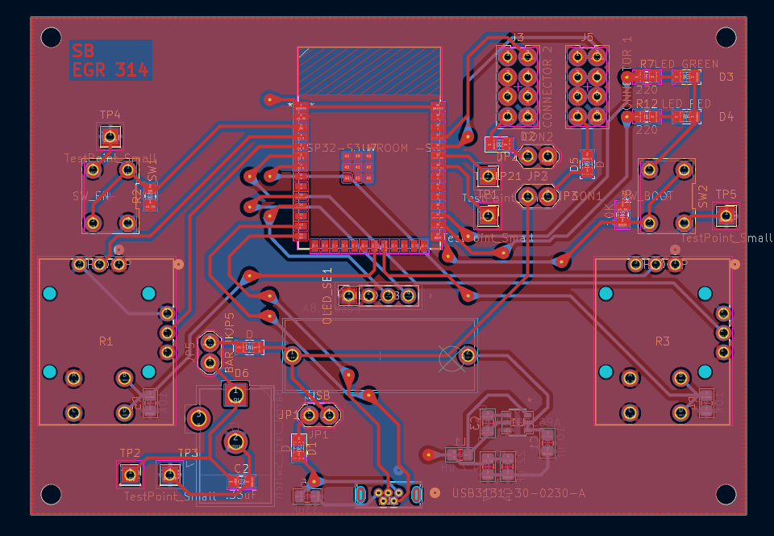

## PCB

This PCB is based on the schematic described earlier. 

{style width:"350" height:"300;"}
**Figure ##:** Showing the schematic.

## Resouces

The schematic as a PDF download is available [*here*](color.pdf), the Gerber Zip folder of the project [*here*](SamBurns308Gerber.zip), and the JLCDRM check PDF is available [*here*](DFM.pdf).

## Final Look 

{style width:"350" height:"300;"}
**Figure ##:** Top view of completed project.

{style width:"350" height:"300;"}
**Figure ##:** the external power regulator to help stabalize power.

{style width:"350" height:"300;"}
**Figure ##:** Bottom view of completed project.

## Final Notes

This is both the same project and a completly different build all at the same time. If I had more time I would have liked to push for an early PCB purchase, learn from it and then make a new one entirely. I had to custom solder my USB port due to issues with mounting it wrong, becase I forgot that I had placd the USB on the back... 

I also had cross wired my buttons to where they were always "pressed". 